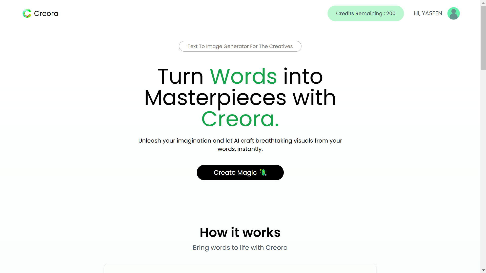

# Creora

**Creora** is a **text-to-image generation SaaS** application powered by the **Clipdrop API**. It provides users with an intuitive platform to generate stunning images from text prompts, enabling creativity and efficiency for artists, designers, and enthusiasts.

## Features

- **Text-to-Image Conversion**: Generate visuals effortlessly with the Clipdrop API.
- **User Authentication**: Secure login and registration using JWT.
- **Responsive UI**: Built with React and Vite for fast and seamless performance.
- **Scalable Backend**: Developed with Node.js, Express, and MongoDB for robustness.
- **Error Feedback**: Clear and actionable error messages to guide users.
- **Environment-Ready**: Deployed with best practices for both frontend and backend separation.

---

## Tech Stack

**Frontend**:

- **Framework**: React (with Vite for blazing-fast builds)
- **Styling**: Tailwind CSS
- **API Communication**: Axios

**Backend**:

- **Server**: Node.js
- **Framework**: Express.js
- **Database**: MongoDB (via Mongoose)

**API Integration**:

- **Clipdrop API** for text-to-image generation

**Hosting**:

- Frontend and backend deployed separately (update hosting details).

---

## Getting Started

Follow these steps to set up Creora locally:

### Prerequisites

- **Node.js** installed
- **MongoDB** (local or cloud-based)
- **Clipdrop API Key**

---

### 1. Clone the Repository

```bash
git clone https://github.com/yaseenpkay/Creora.git
cd Creora
```

---

### 2. Backend Setup

1. Navigate to the backend directory:
   ```bash
   cd backend
   ```
2. Install dependencies:
   ```bash
   npm install
   ```
3. Create a `.env` file in the `backend` folder with the following variables:
   ```plaintext
   PORT=4000
   MONGO_URI=your-mongodb-uri
   CLIPDROP_API_KEY=your-clipdrop-api-key
   ```
4. Start the backend server:
   ```bash
   npm start
   ```

---

### 3. Frontend Setup

1. Navigate to the frontend directory:
   ```bash
   cd ../frontend
   ```
2. Install dependencies:
   ```bash
   npm install
   ```
3. Create a `.env` file in the `frontend` folder with the following variable:
   ```plaintext
   VITE_BACKEND_URL=http://localhost:4000
   ```
4. Start the frontend server:
   ```bash
   npm run dev
   ```

---

### 4. Access the Application

Open your browser and navigate to `http://localhost:5173` to access the Creora application.

---

## Screenshots

### Home Page

The landing page of **Creora**, showcasing its simple and intuitive design.


### About Page

Learn about the features and functionality of **Creora**.


### Result Page

A sample result of the text-to-image generation powered by the ClipDrop API.


### Pricing Page

Details about pricing plans for **Creora**'s services.


---

## Roadmap

- **Enhance Image Customization**: Add options for resizing, filters, and effects.
- **Gallery Feature**: Save and organize generated images in user profiles.
- **Multi-Language Support**: Expand usability for global audiences.
- **Subscription Plans**: Introduce tiered plans for premium features.

---

## Contributing

Contributions are welcome! Follow these steps to contribute:

1. Fork the repository.
2. Create a new branch:
   ```bash
   git checkout -b feature-name
   ```
3. Commit your changes:
   ```bash
   git commit -m "Add feature-name"
   ```
4. Push your branch:
   ```bash
   git push origin feature-name
   ```
5. Submit a pull request for review.

---

## Contact

For any questions or feedback:

- **Author**: Yaseen PK
- **GitHub**: [yaseenpkay](https://github.com/yaseenpkay)
